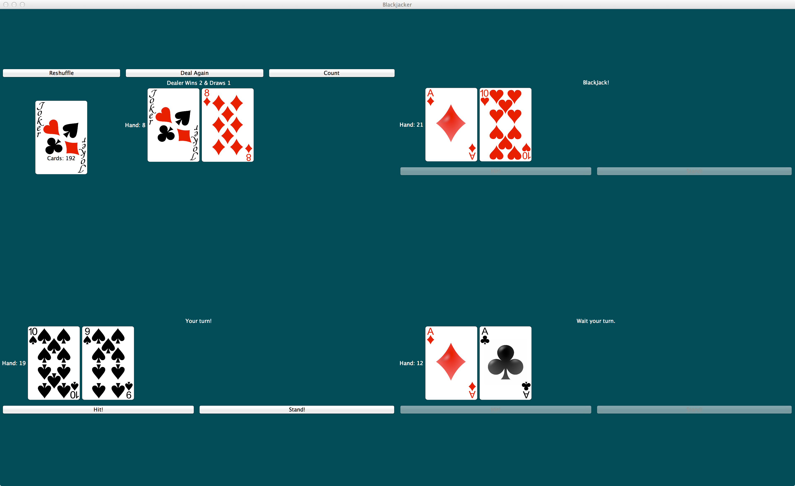

Blackjacker
===========

> Hack the game of Blackjack!

## Presentation
See https://docs.google.com/presentation/d/1ri4L3ublScE9f7l4AuuQ8kLmGDaOgCts3ntlryyuew8/edit?usp=sharing 

-----

## Download

See [Releases](https://github.com/Glavin001/Blackjacker/releases) for prebuilt exectuable Jars.

## Installation from Source Code

Clone this repository.
Use [Eclipse](https://www.eclipse.org/) to open/[switch to this Workspace](http://help.eclipse.org/juno/index.jsp?topic=%2Forg.eclipse.platform.doc.user%2Freference%2Fref-workspaceswitch.htm), the root repository directory.

## Documentation

See [Documentation/ directory](Documentation/).

## Design

See [Design/ directory](Design/).

## Authors

- Glavin Wiechert <glavin.wiechert@gmail.com> (https://github.com/Glavin001)
- Faisal K. AlMazroa (https://github.com/FaisalAlMazroa)
- Dylan Young Meijer (https://github.com/DylanYoung)
